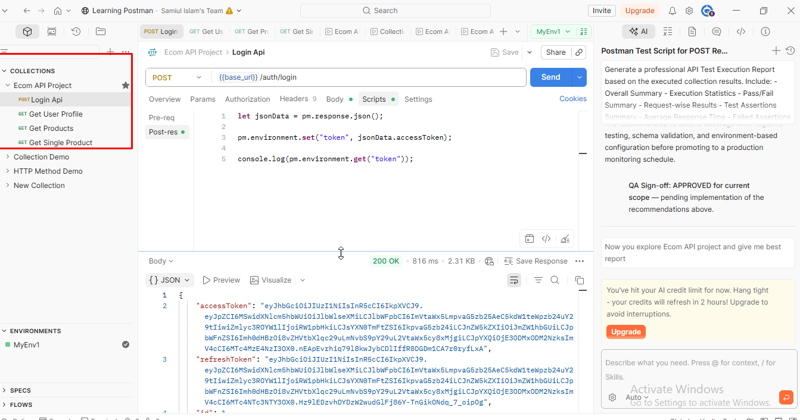
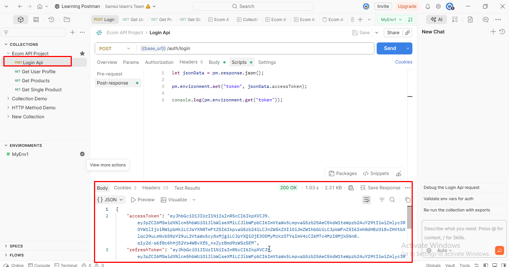
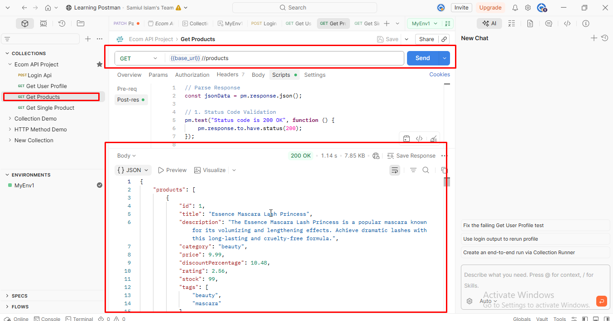
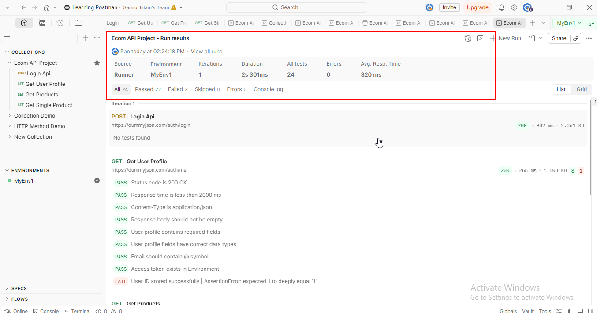

# 🛒 Ecom API Testing using Postman


---

## 📖 Project Overview

This project demonstrates **REST API Testing** for an E-commerce application using **Postman**.

The project covers authentication, user profile retrieval, product listing, and single product retrieval while validating API responses through automated Postman test scripts.

The objective of this project is to showcase practical API testing skills including:

- API Request Validation
- Environment Variables
- API Chaining
- Automated Test Scripts
- Response Validation
- Professional Test Documentation

---

# 🛠 Tools & Technologies

- Postman v11
- DummyJSON REST API
- JavaScript (Postman Test Scripts)
- REST API
- Environment Variables
- JSON
- Git & GitHub

---

# 📂 Project Structure

```
Ecom-API-Testing-Postman
│
├── collections
│   └── Ecom API Project.postman_collection.json
│
├── environments
│   └── MyEnv1.postman_environment.json
│
├── screenshots
│   ├── collection.png
│   ├── Login.png
│   ├── USER PROFILE.png
│   ├── PRODUCTS.png
│   ├── SINGLE PRODUCT.png
│   └── Runner.png
│
└── README.md
```

---

# 📸 Project Screenshots

## 📁 Collection Structure



---

## 🔐 Login API

Generates an Access Token for authenticated requests.



---

## 👤 Get User Profile

Retrieves authenticated user information.


---

## 📦 Get Products

Returns the list of available products.



---

## 📄 Get Single Product

Retrieves a single product using the stored Environment Variable.


---

## ▶️ Collection Runner Result

Collection executed successfully using Postman Runner.



---

# 🚀 APIs Covered

| API | Method | Description |
|------|--------|-------------|
| Login API | POST | Authenticate user and generate access token |
| Get User Profile | GET | Retrieve authenticated user information |
| Get Products | GET | Retrieve all available products |
| Get Single Product | GET | Retrieve a specific product |

---

# ✅ Test Coverage

The following validations were performed for each API.

- ✔ Status Code Validation
- ✔ Response Time Validation
- ✔ Response Header Validation
- ✔ Content-Type Validation
- ✔ Response Body Validation
- ✔ Required Field Validation
- ✔ Data Type Validation
- ✔ Environment Variable Validation
- ✔ API Chaining
- ✔ Automated Test Scripts

---

# 📊 Execution Summary

| Metric | Value |
|--------|------:|
| Total Requests | 4 |
| Total Assertions | 24 |
| Passed | 22 |
| Failed | 2 |
| Pass Rate | **91.67%** |
| Average Response Time | **116 ms** |

---

# ⚠ Known Issues

Two test assertions failed due to **Number vs String** comparison while validating Environment Variables.

Example:

```
Expected:

1

Received:

"1"
```

These failures are related to the **Postman test script**, **not the API itself**.

### Recommended Fix

```javascript
pm.expect(Number(pm.environment.get("user_id"))).to.eql(jsonData.id);

pm.expect(Number(pm.environment.get("product_id"))).to.eql(jsonData.products[0].id);
```

---

# 💡 Future Improvements

- Add Negative Test Cases
- JSON Schema Validation
- Newman HTML Report
- CI/CD Integration
- GitHub Actions Automation
- API Monitoring
- Data Driven Testing

---

# ▶ How to Run

1. Import the Collection.
2. Import the Environment.
3. Select **MyEnv1**.
4. Execute **Login API**.
5. Run the remaining APIs.
6. Run the complete collection using **Collection Runner**.

---

# 📈 Skills Demonstrated

- REST API Testing
- Postman
- JavaScript
- Environment Variables
- API Chaining
- Response Validation
- Automation Testing Basics
- QA Documentation
- GitHub Project Management

---

# 👨‍💻 Author

**Samiul Islam**

Software Quality Assurance (SQA) Engineer

GitHub:
https://github.com/samiul501

---

## ⭐ If you found this project useful, feel free to give it a Star.
